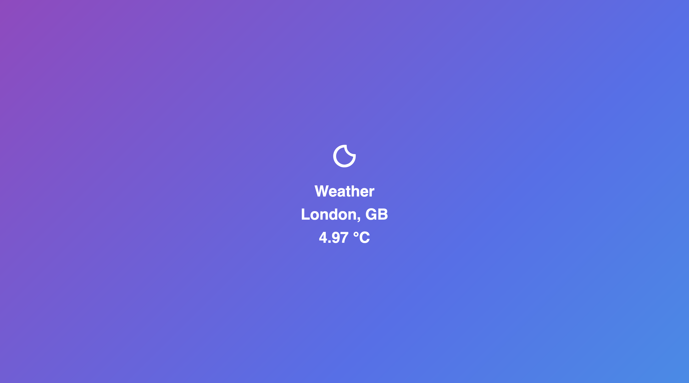

# Minimalist Weather App



Built using this [FreeCodeCamp tutorial](https://www.freecodecamp.org/news/how-to-build-a-web-app-using-pythons-flask-and-google-app-engine-52b1bb82b221/) and the [Flask docs](https://flask.palletsprojects.com/en/1.1.x/quickstart/)

# Why this project?

After doing a doing a lot of AI engineering recently in Python I wanted to start looking at potential frameworks to also build web UIs for the machine learning models.

This is why I chose [Flask](https://flask.palletsprojects.com/en/1.1.x/)

# What will I learn?

- basic MVC app with routing and requests
- handling environment variables
- deploying a Flask application
- deep dive into the Python syntax
- handling dependencies in Python with pip3 and requierments.txt
- Flask deployment on Serverless framework

# Running the app

## Pre-requisites 

* Python3
* API key from [Open Weather Map](openweathermap.org)
* [Serverless framework CLI](https://serverless.com/framework/docs/getting-started/) (only for deployment)
* [Amazon Web Services](https://aws.amazon.com/) account (only for deployment)
* [Amazon Web Services CLI](https://github.com/aws/aws-cli) connected to your account (only for deployment)
* Optional - [Serverless Framework account](serverless.com/)

## Environment setup 

Create a venv folder (on MacOS)

```zsh
python3 -m venv venv
```

Activate the environment

```zsh
. venv/bin/activate
```

## Installation

Use the package manager [pip3](https://pip.pypa.io/en/stable/) to install app dependencies.

```bash
pip3 install -r requirements.txt
```

## Start the app

```zsh
export API_KEY='YOUR_KEY_GOES_HERE'
python run-app.py
```
# Deployment

## Install 

Install the Serverless Framework plugins

```zsh
npm i
```

## Serve locally 

Leverage the Serverless WSGI pluging to serve the app locally before deployment

```zsh
sls wsgi serve
```

## Pre-deploy

Create a serverless.yml file

```yml
service: minimalist-weather-app

provider:
  name: aws
  runtime: python3.7
  stage: dev
  region: your-region
  memorySize: 128
  environment:
    API_KEY: "YOUR_KEY_GOES_HERE"

plugins:
  - serverless-wsgi
  - serverless-python-requirements

custom:
  wsgi:
    app: app.app
    packRequirements: false

functions:
  app:
    handler: wsgi.handler
    events:
      - http: ANY /
      - http: "ANY {proxy+}"

```

## Deployment 

Deploy using the Serverless Framework. 

```zsh
sls serve
```
It takes a while so go and make yourself a brew.


Done? Good! 🎉 

Your enpoints will be there in the console.


# Attributions

* Tristan Ganry for the [FreeCodeCamp tutorial](https://www.freecodecamp.org/news/how-to-build-a-web-app-using-pythons-flask-and-google-app-engine-52b1bb82b221/)
* Michal Haták for the [Serverless deployment guide](https://medium.com/@Twistacz/flask-serverless-api-in-aws-lambda-the-easy-way-a445a8805028)
* Максим Ильюшин for the lovely background, as seen on this [Codepen](https://codepen.io/fsti73/pen/XWbbBda)
* Rodney Dangerfield for [the coffee gif](https://giphy.com/gifs/rodneydangerfield-monday-back-to-school-rodney-dangerfield-XEOdmFHVznCerkI6CI/media)

# Contributing

Pull requests are welcome. For major changes, please open an issue first to discuss what you would like to change.

Please make sure to update tests as appropriate.

# License

[MIT](https://choosealicense.com/licenses/mit/)
